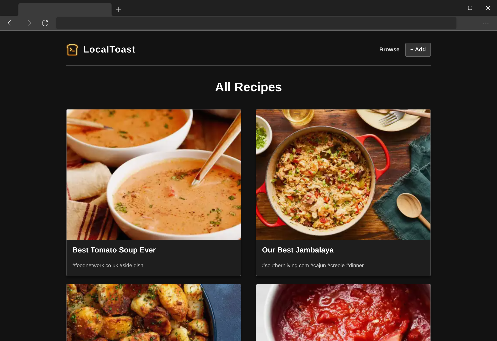
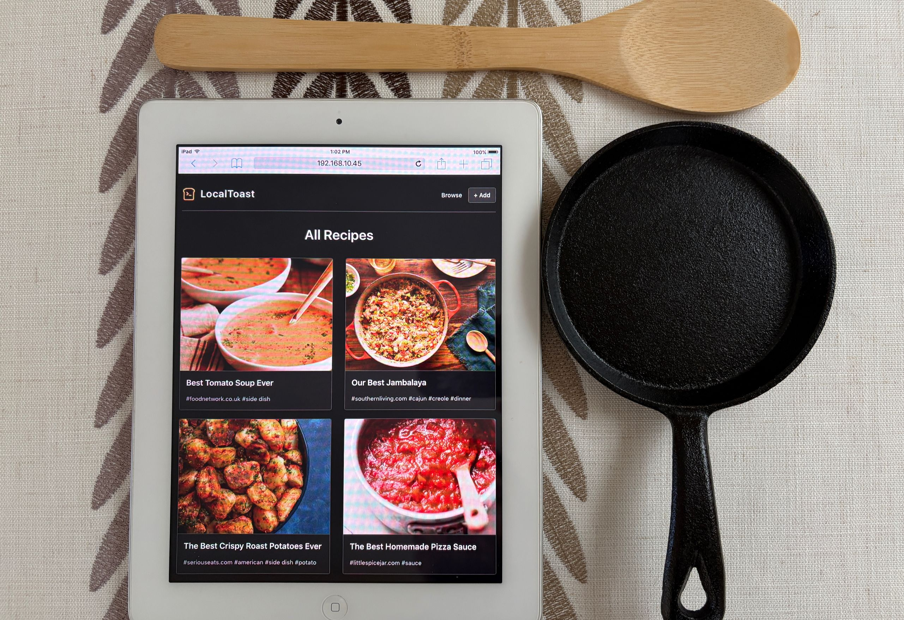

# LocalToast 🍞


**A containerized, self-hosted recipe manager designed for extreme performance and digital longevity.**

LocalToast is a homelab application built to combat the bloat of modern recipe websites. It strips away ads, trackers, pop-ups, and the 2,000-word life stories about the author's childhood. LocalToast extracts just the recipe, storing it as a simple text file that loads instantly on pretty much *any* device - from a brand new iPhone to a dusty tablet from 2011.

## 📸 Screenshots

<table>
  <tr>
    <td width="50%">
      <h3 align="center">Modern Desktop</h3>
      <div align="center">
        
      </div>
    </td>
    <td width="50%">
      <h3 align="center">iPad 2 (Legacy)</h3>
      <div align="center">
        
      </div>
    </td>
  </tr>
</table>

## ✨ Key Features

* **🚀 Blazing Fast:** Built on a "Hybrid" Static Site architecture. Recipes are pre-rendered into static HTML for instant loading, while a backend API handles editing and imports.
* **💾 You Own Your Data:** No database lock-in. Recipes are stored as standard Markdown files with YAML frontmatter. Backing up your cookbook is as simple as copying a folder.
* **🍳 Smart Ingestion:** Paste a URL to automatically scrape the title, ingredients, image, and instructions. Powered by the robust [recipe-scrapers](https://github.com/hhursev/recipe-scrapers) library, supporting hundreds of sites.
* **📱 Universal Compatibility:** Engineered to prevent software rot. The frontend uses strict standards that run flawlessly on legacy devices (like old iPads or Android tablets) without sacrificing modern usability.
* **⚡ Kitchen Mode:** Automatically prevents your screen from locking while you cook, ensuring your recipe is always visible without touching the device.

## 🚀 Quick Start

No build steps required. We automatically rebuild the container **every week** to ensure the recipe scrapers are always up to date with the latest website layouts.

### 1. Create a `docker-compose.yml`

Copy this into a folder on your server (e.g., `~/localtoast`):

```yaml
services:
  localtoast:
    image: ghcr.io/RayNieport/localtoast:latest
    container_name: localtoast
    restart: unless-stopped
    ports:
      - "8080:8080"
    environment:
      - TZ=America/New_York
      # Set UPDATE_SCRAPERS=true and restart to force an update of the scraper library.
      - UPDATE_SCRAPERS=false
    volumes:
      - ./recipes:/app/site/content/recipes

```

### 2. Run it

```bash
docker-compose up -d
```

That's it. Access LocalToast at `http://localhost:8080`.

> **Note:** The container runs as a non-root user (UID 1000). Ensure your `./recipes` folder is writable by your local user.

## 🛠️ Architecture

LocalToast uses a **Supervisord** managed container to run three services efficiently:

1. **Ingester (FastAPI):** Handles URL scraping, image optimization (WebP/JPG generation), and file operations.
2. **Viewer (Hugo):** Runs in "Watch" mode to instantly regenerate static HTML when recipes change.
3. **Proxy (Nginx):** Serves the static site and reverse-proxies API calls, configured with aggressive caching headers.

## 🤝 Contributing

We welcome contributions! However, to maintain support for legacy devices (like the iPad 2), we have strict coding standards (ES5 JavaScript, specific CSS constraints).

**Please read [CONTRIBUTING.md](CONTRIBUTING.md) before submitting a Pull Request.**

## ❤️ Acknowledgements

* **[recipe-scrapers](https://github.com/hhursev/recipe-scrapers):** The heavy lifting for URL ingestion is handled by this fantastic library.
* **[Hugo](https://gohugo.io/):** For the blazing fast static site generation.
* **[FastAPI](https://fastapi.tiangolo.com/):** For the high-performance backend API.

## 📄 License

MIT License. See `LICENSE` for details.

---

*Served hot by LocalToast.* 🍞